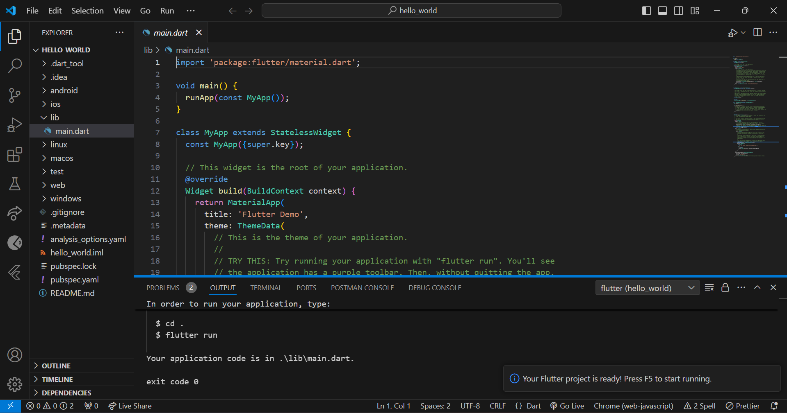
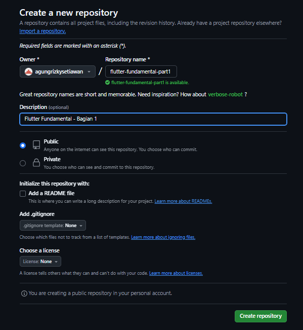
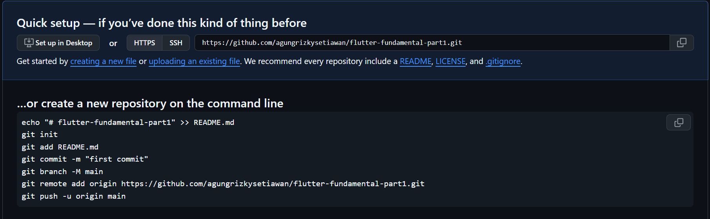
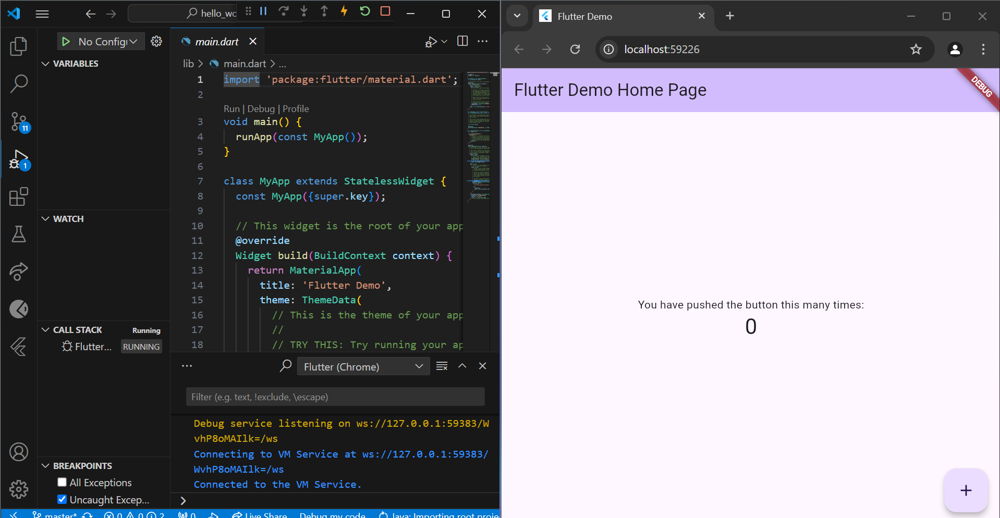
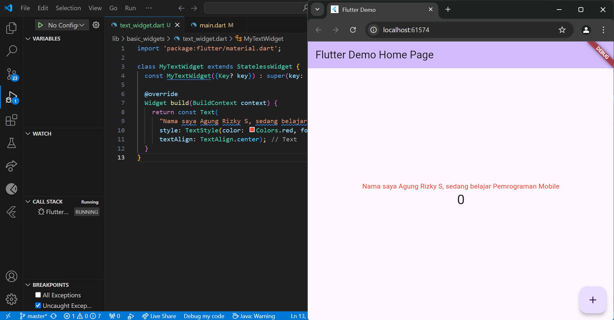
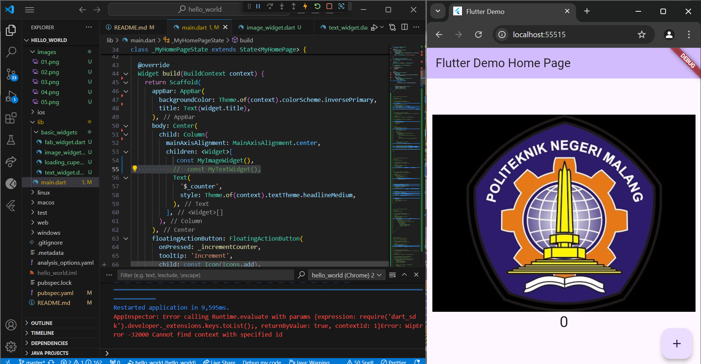
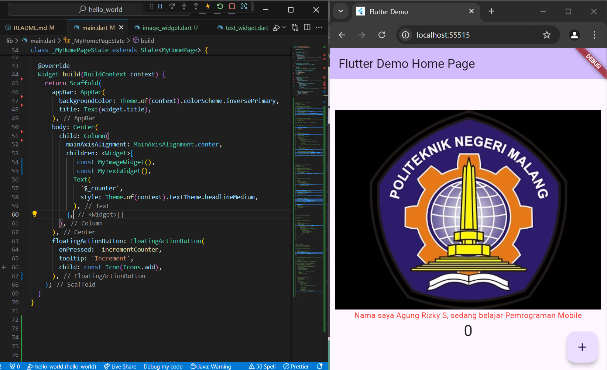

# NAMA : AGUNG RIZKY SETIAWAN
# NIM : 2241720187
# KELAS : TI-3C

A new Flutter project.
## --------------------Praktikum 1:---------------------------
### tampilan jika sudah membuat project flutter

## --------------------Praktikum 2:---------------------------
### tampilan repository baru dengan nama "flutter-fundamental-part1"

### tampilan sesudah membuat repository

### tampilan hasil run > start debunging

## --------------------Praktikum 3:---------------------------
### Langkah 1: Text Widget Buat folder baru basic_widgets di dalam folder lib.

### Langkah 2: Image Widget Buat sebuah file image_widget.dart di dalam folder basic_widgets

### Tampilan hasil penggabungan antara langkah 1 dan langkah 2

